

  

<h1 align="center">Effin Music Player</h1>

  Minimal • Fast • Material You

  

  
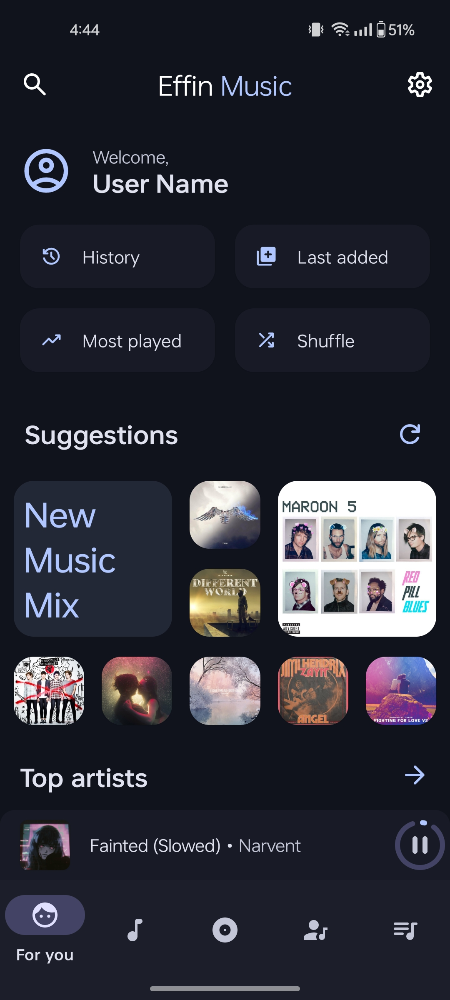 

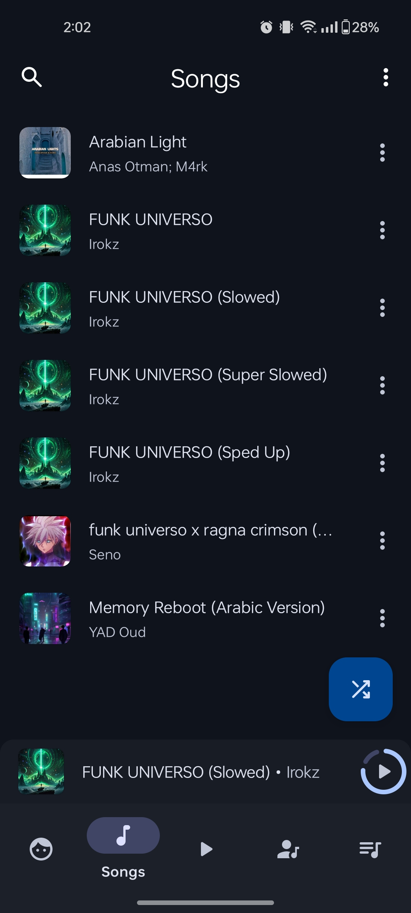

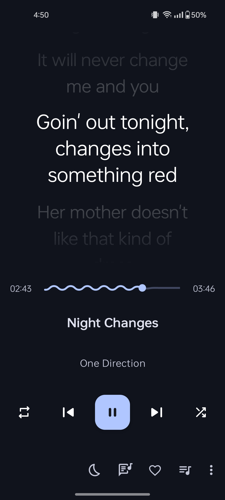
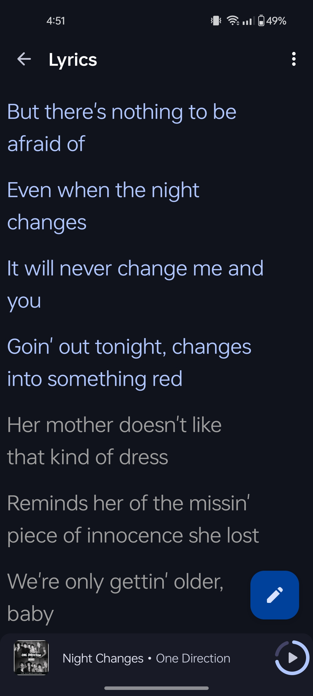

  

### 10+ Now playing themes
| 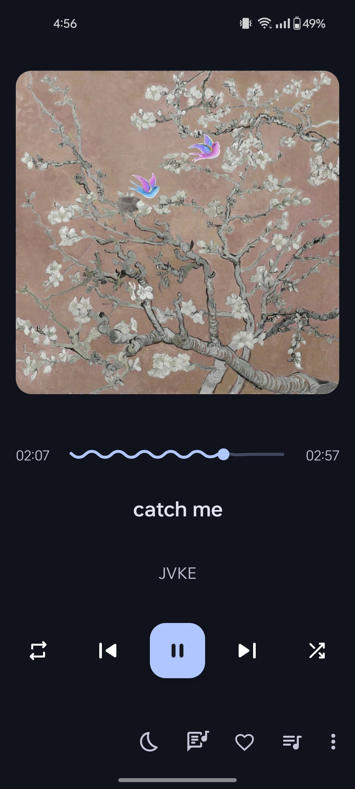	|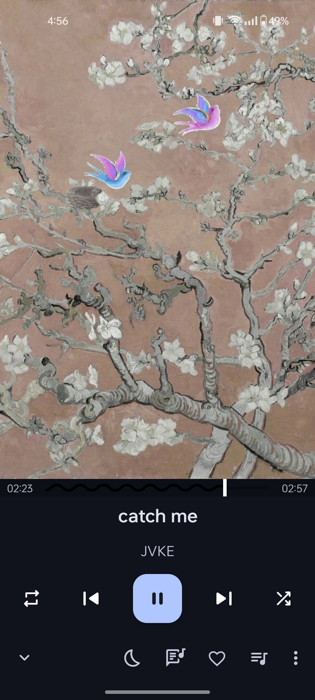|   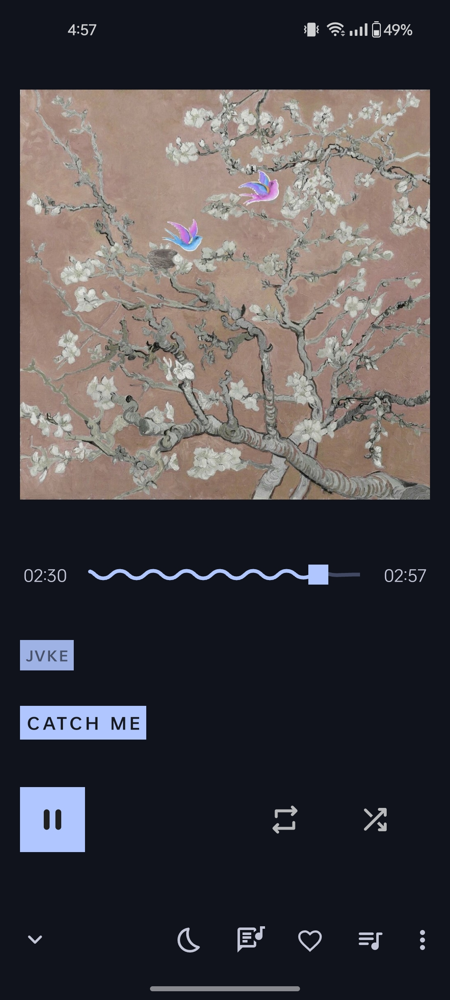  	|    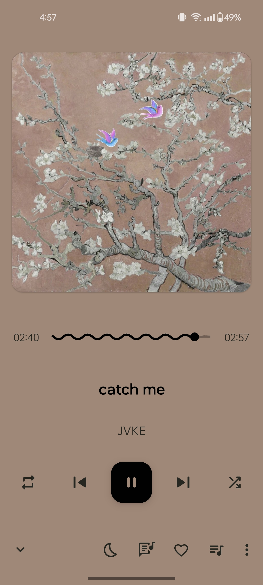 	|     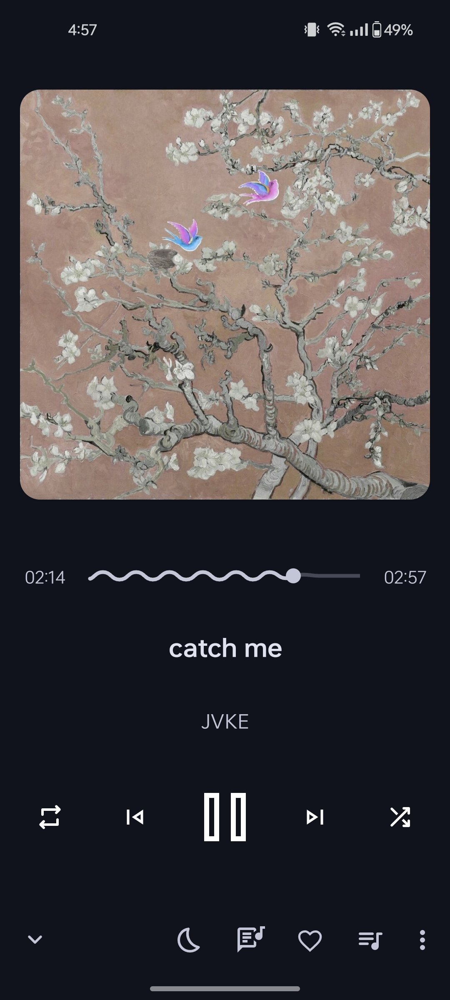	|
|:-----:	|:-----:	|:-----:	|:-----:	|:-----:	|
| Normal 	| Fit 	| Flat 	| Color 	| Material 	|

| 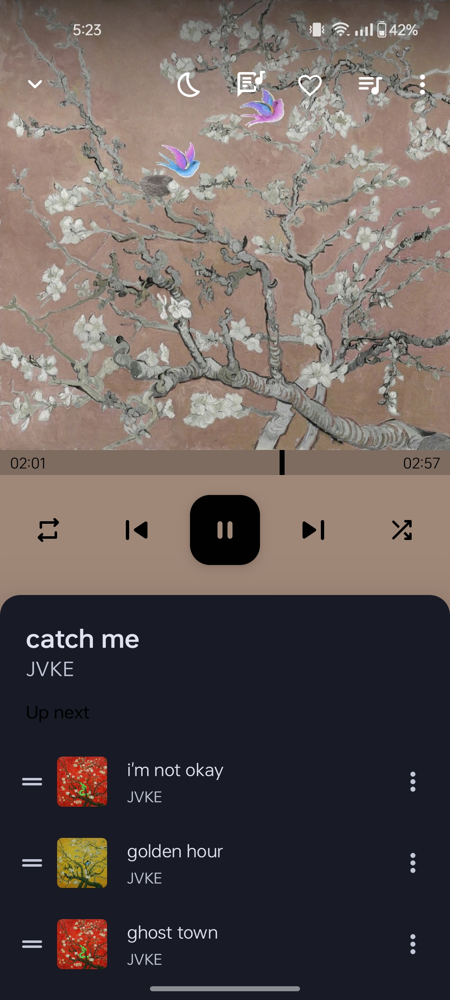	|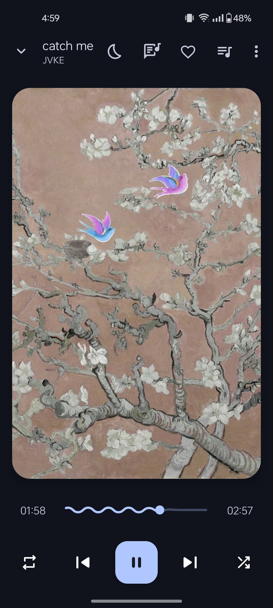|   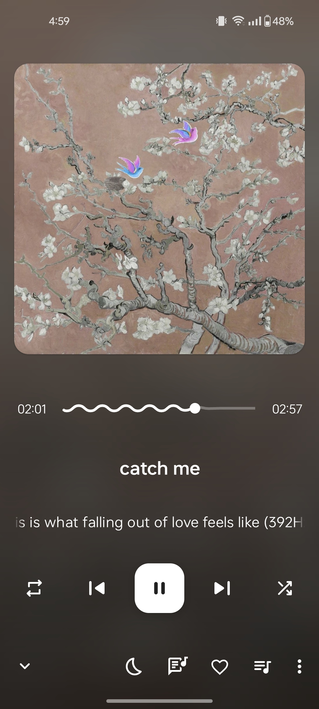  	|    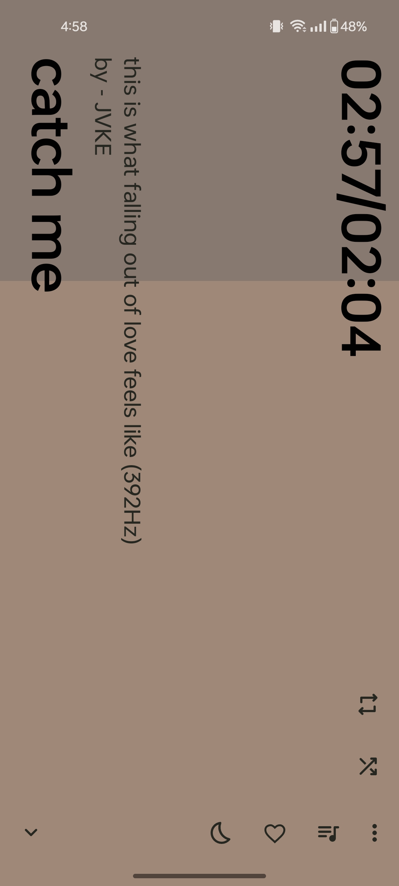 	|     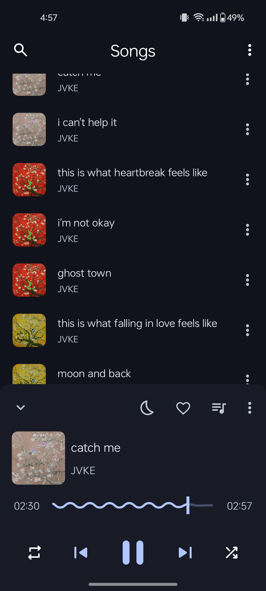	|
|:-----:	|:-----:	|:-----:	|:-----:	|:-----:	|
| Classic 	| Adaptive 	| Blur 	| Tiny 	| Peek 	|

## Download

## 📦 Included Features
- Fast!
- Major bugs fixed
- Samples
- LRCLIB Lyrics
- Improved Search Bar
- Minimal Artist
- Artist Delimiter
- Wavy Slider
- ReplayGain
- Settings Search Bar
- Double Tap to Favorite
- Built-in Equalizer
- Playlist Drag-Drop
- Sort by Recording date
- Custom Library
- Highly Customizable
- Pro Features
- Everything that Retro has

## ❓ FAQ
Please read the FAQ [here](https://github.com/effinmr/EffinMusic/blob/main/FAQ.md)

In any case, if you find or notice any bugs please report them by creating an issue or by contacting us in the [Report a Bug](https://github.com/effinmr/EffinMusic/issues/new?template=bug_report.md).
If you have any feature suggestions, please create an issue with detailed information or by contacting us in the [Request a new feature](https://github.com/effinmr/EffinMusic/issues/new?template=feature_request.md).

## 🗂️ License

Retro Music Player is released under the GNU General Public License v3.0
(GPLv3), which can be found [here](LICENSE.md)
