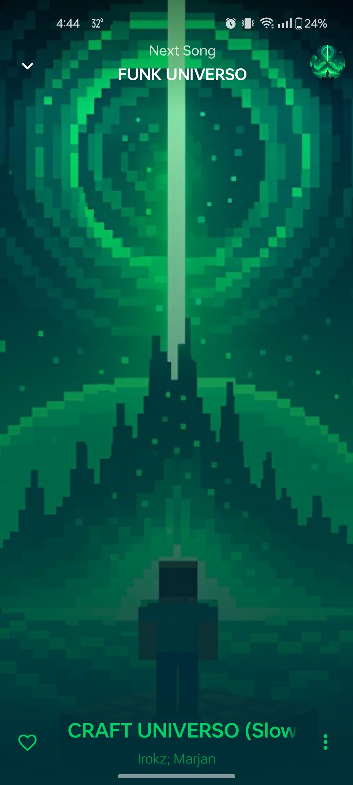

  

<h1 align="center">Effin Music Player</h1>

  Minimal • Fast • Highly Customizable • Material You

  

  

---

## 📱 Screenshots

  
  
  
  
  
  
  
  
  
  
  
  
  
  
  

---

## ⬇️ Download

  

---

## ✨ Features

### ⚡ Performance
Fast, lightweight, and optimized for smooth playback with critical bug fixes.

### 🎵 Music & Playback
- Youtube Shorts like Samples
- ReplayGain for consistent volume  
- Built-in equalizer  
- LRCLIB lyrics integration  

### 🔎 Library & Search
- Improved search experience  
- Settings search bar  
- Custom library support  
- Sort by recording date  

### 🎨 UI / UX
- Minimal artist view  
- Artist delimiter
- Fluid wavy slider UI  
- Highly customizable Material You design  

### ❤️ Interaction
- Double-tap to favorite songs  
- Drag-and-drop playlist management  

### 🚀 Extras
- Pro features included  
- Based on Retro Music Player features  

---

## ❓ FAQ

Please read the FAQ [here](https://github.com/effinmr/EffinMusic/blob/main/FAQ.md)

If you encounter bugs:
- Open an issue using the bug template
- Or report it via GitHub issues

Feature requests:
- Use GitHub issues with clear descriptions

---

## 📄 License

Effin Music Player is licensed under the GNU General Public License v3.0 (GPLv3).  
See the [LICENSE](LICENSE.md) file for details.
